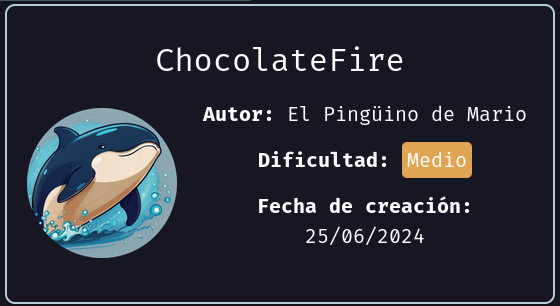
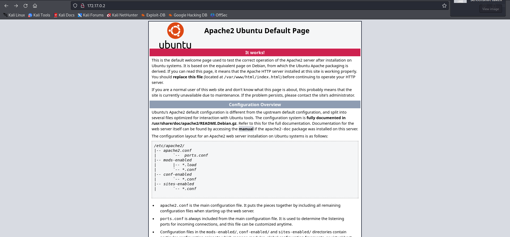
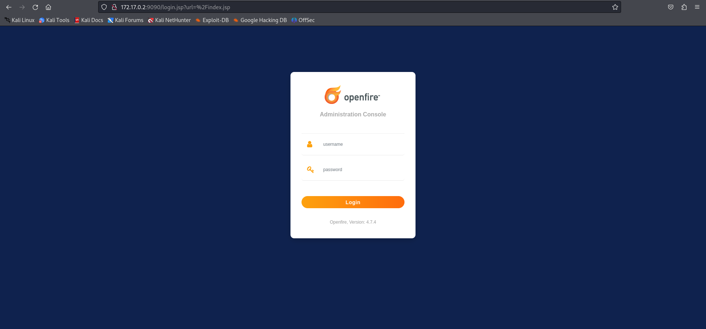
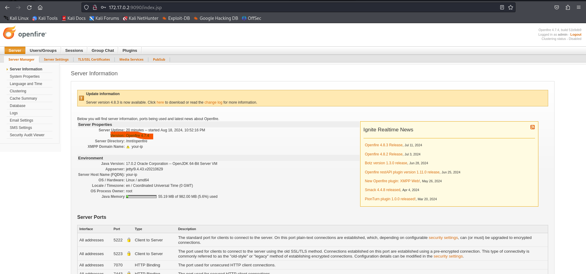
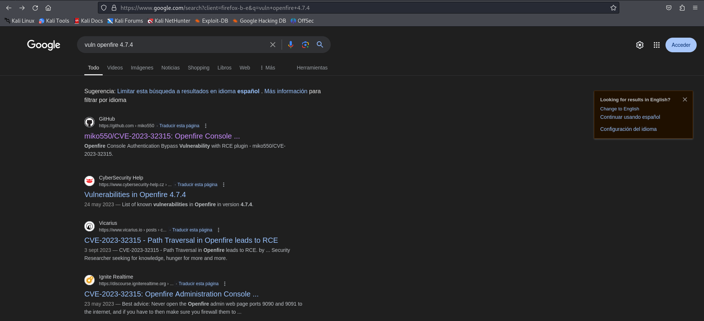
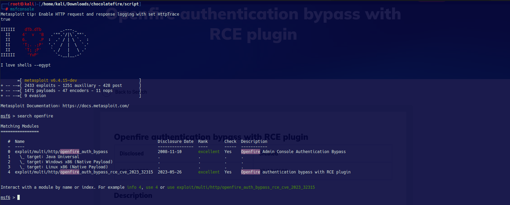
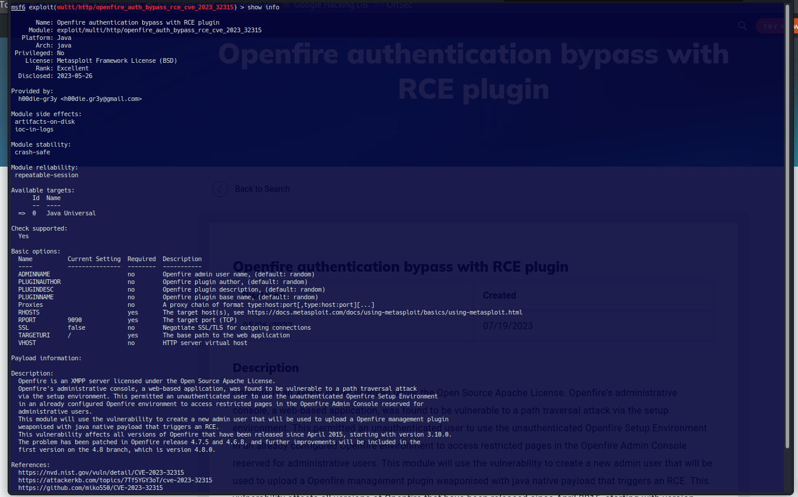
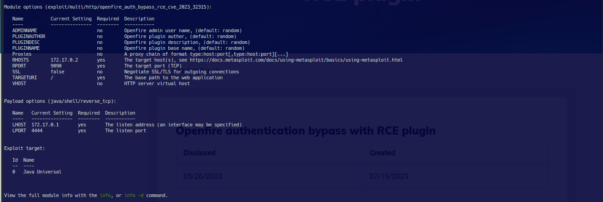
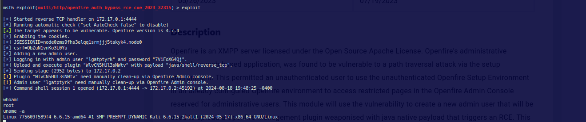
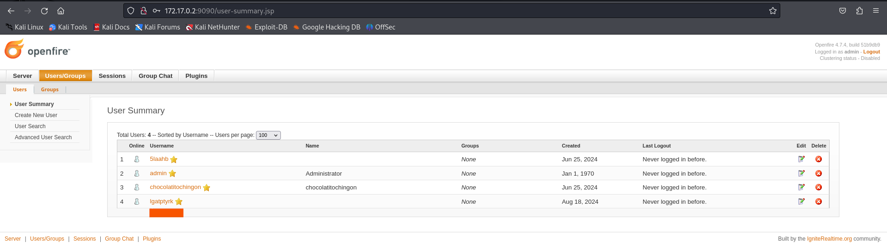

# ChocolateFire
Máquina DockerLab



## Reconocimiento

Una vez iniciada la máquina con Dockers, y conociendo que la ip es: 172.17.0.2, podemos revisar que contiene por medio del browser.



## Escaneo y enumeración

Ahora podemos revisar que contiene la máquina usando nmap y el siguiente script.

```
nmap -sV --script vuln --host-timeout 2500 -oN scan_v1_172.17.0.2.txt 172.17.0.2
```

El resultado de este reconocimeinto es:

```
# Nmap 7.94SVN scan initiated Thu Jul 18 12:46:56 2024 as: nmap -sV --script vuln --host-timeout 2500 -oN scan_v1_172.17.0.2.txt 172.17.0.2
Nmap scan report for 172.17.0.2
Host is up (0.0000050s latency).
Not shown: 994 closed tcp ports (reset)
PORT     STATE SERVICE     VERSION
22/tcp   open  ssh         OpenSSH 8.4p1 Debian 5+deb11u3 (protocol 2.0)
| vulners: 
|   cpe:/a:openbsd:openssh:8.4p1: 
|     	CVE-2023-38408	9.8	https://vulners.com/cve/CVE-2023-38408
|     	B8190CDB-3EB9-5631-9828-8064A1575B23	9.8	https://vulners.com/githubexploit/B8190CDB-3EB9-5631-9828-8064A1575B23	*EXPLOIT*
|     	8FC9C5AB-3968-5F3C-825E-E8DB5379A623	9.8	https://vulners.com/githubexploit/8FC9C5AB-3968-5F3C-825E-E8DB5379A623	*EXPLOIT*
|     	SSV:92579	7.5	https://vulners.com/seebug/SSV:92579	*EXPLOIT*
|     	PACKETSTORM:173661	7.5	https://vulners.com/packetstorm/PACKETSTORM:173661	*EXPLOIT*
|     	F0979183-AE88-53B4-86CF-3AF0523F3807	7.5	https://vulners.com/githubexploit/F0979183-AE88-53B4-86CF-3AF0523F3807	*EXPLOIT*
|     	1337DAY-ID-26576	7.5	https://vulners.com/zdt/1337DAY-ID-26576	*EXPLOIT*
|     	CVE-2021-28041	7.1	https://vulners.com/cve/CVE-2021-28041
|     	CVE-2021-41617	7.0	https://vulners.com/cve/CVE-2021-41617
|     	CVE-2023-51385	6.5	https://vulners.com/cve/CVE-2023-51385
|     	CVE-2023-48795	5.9	https://vulners.com/cve/CVE-2023-48795
|     	CVE-2020-14145	5.9	https://vulners.com/cve/CVE-2020-14145
|     	CVE-2016-20012	5.3	https://vulners.com/cve/CVE-2016-20012
|     	CVE-2021-36368	3.7	https://vulners.com/cve/CVE-2021-36368
|_    	PACKETSTORM:140261	0.0	https://vulners.com/packetstorm/PACKETSTORM:140261	*EXPLOIT*
5222/tcp open  jabber
| xmpp-info: 
|   STARTTLS Failed
|   info: 
|     capabilities: 
|     features: 
|     compression_methods: 
|     stream_id: aw6m1yankd
|     unknown: 
|     auth_mechanisms: 
|     errors: 
|       invalid-namespace
|       (timeout)
|     xmpp: 
|_      version: 1.0
|_rsa-vuln-roca: ERROR: Script execution failed (use -d to debug)
| fingerprint-strings: 
|   RPCCheck: 
|_    <stream:error xmlns:stream="http://etherx.jabber.org/streams"><not-well-formed xmlns="urn:ietf:params:xml:ns:xmpp-streams"/></stream:error></stream:stream>
5269/tcp open  xmpp        Wildfire XMPP Client
| xmpp-info: 
|   STARTTLS Failed
|   info: 
|     capabilities: 
|     features: 
|     compression_methods: 
|     unknown: 
|     auth_mechanisms: 
|     errors: 
|       (timeout)
|_    xmpp: 
7070/tcp open  realserver?
| fingerprint-strings: 
|   DNSStatusRequestTCP, DNSVersionBindReqTCP: 
|     HTTP/1.1 400 Illegal character CNTL=0x0
|     Content-Type: text/html;charset=iso-8859-1
|     Content-Length: 69
|     Connection: close
|     <h1>Bad Message 400</h1><pre>reason: Illegal character CNTL=0x0</pre>
|   GetRequest: 
|     HTTP/1.1 200 OK
|     Date: Thu, 18 Jul 2024 16:47:13 GMT
|     Last-Modified: Wed, 16 Feb 2022 15:55:03 GMT
|     Content-Type: text/html
|     Accept-Ranges: bytes
|     Content-Length: 223
|     <html>
|     <head><title>Openfire HTTP Binding Service</title></head>
|     <body><font face="Arial, Helvetica"><b>Openfire <a href="http://www.xmpp.org/extensions/xep-0124.html">HTTP Binding</a> Service</b></font></body>
|     </html>
|   HTTPOptions: 
|     HTTP/1.1 200 OK
|     Date: Thu, 18 Jul 2024 16:47:18 GMT
|     Allow: GET,HEAD,POST,OPTIONS
|   Help: 
|     HTTP/1.1 400 No URI
|     Content-Type: text/html;charset=iso-8859-1
|     Content-Length: 49
|     Connection: close
|     <h1>Bad Message 400</h1><pre>reason: No URI</pre>
|   RPCCheck: 
|     HTTP/1.1 400 Illegal character OTEXT=0x80
|     Content-Type: text/html;charset=iso-8859-1
|     Content-Length: 71
|     Connection: close
|     <h1>Bad Message 400</h1><pre>reason: Illegal character OTEXT=0x80</pre>
|   RTSPRequest: 
|     HTTP/1.1 505 Unknown Version
|     Content-Type: text/html;charset=iso-8859-1
|     Content-Length: 58
|     Connection: close
|     <h1>Bad Message 505</h1><pre>reason: Unknown Version</pre>
|   SSLSessionReq: 
|     HTTP/1.1 400 Illegal character CNTL=0x16
|     Content-Type: text/html;charset=iso-8859-1
|     Content-Length: 70
|     Connection: close
|_    <h1>Bad Message 400</h1><pre>reason: Illegal character CNTL=0x16</pre>
7777/tcp open  socks5      (No authentication; connection failed)
9090/tcp open  zeus-admin?
| fingerprint-strings: 
|   GetRequest: 
|     HTTP/1.1 200 OK
|     Date: Thu, 18 Jul 2024 16:47:13 GMT
|     Last-Modified: Wed, 16 Feb 2022 15:55:03 GMT
|     Content-Type: text/html
|     Accept-Ranges: bytes
|     Content-Length: 115
|     <html>
|     <head><title></title>
|     <meta http-equiv="refresh" content="0;URL=index.jsp">
|     </head>
|     <body>
|     </body>
|     </html>
|   HTTPOptions: 
|     HTTP/1.1 200 OK
|     Date: Thu, 18 Jul 2024 16:47:18 GMT
|     Allow: GET,HEAD,POST,OPTIONS
|   JavaRMI, drda, ibm-db2-das, informix: 
|     HTTP/1.1 400 Illegal character CNTL=0x0
|     Content-Type: text/html;charset=iso-8859-1
|     Content-Length: 69
|     Connection: close
|     <h1>Bad Message 400</h1><pre>reason: Illegal character CNTL=0x0</pre>
|   SqueezeCenter_CLI: 
|     HTTP/1.1 400 No URI
|     Content-Type: text/html;charset=iso-8859-1
|     Content-Length: 49
|     Connection: close
|     <h1>Bad Message 400</h1><pre>reason: No URI</pre>
|   WMSRequest: 
|     HTTP/1.1 400 Illegal character CNTL=0x1
|     Content-Type: text/html;charset=iso-8859-1
|     Content-Length: 69
|     Connection: close
|_    <h1>Bad Message 400</h1><pre>reason: Illegal character CNTL=0x1</pre>
3 services unrecognized despite returning data. If you know the service/version, please submit the following fingerprints at https://nmap.org/cgi-bin/submit.cgi?new-service :
==============NEXT SERVICE FINGERPRINT (SUBMIT INDIVIDUALLY)==============
SF-Port5222-TCP:V=7.94SVN%I=7%D=7/18%Time=66994725%P=x86_64-pc-linux-gnu%r
SF:(RPCCheck,9B,"<stream:error\x20xmlns:stream=\"http://etherx\.jabber\.or
SF:g/streams\"><not-well-formed\x20xmlns=\"urn:ietf:params:xml:ns:xmpp-str
SF:eams\"/></stream:error></stream:stream>");
==============NEXT SERVICE FINGERPRINT (SUBMIT INDIVIDUALLY)==============
SF-Port7070-TCP:V=7.94SVN%I=7%D=7/18%Time=66994711%P=x86_64-pc-linux-gnu%r
SF:(GetRequest,189,"HTTP/1\.1\x20200\x20OK\r\nDate:\x20Thu,\x2018\x20Jul\x
SF:202024\x2016:47:13\x20GMT\r\nLast-Modified:\x20Wed,\x2016\x20Feb\x20202
SF:2\x2015:55:03\x20GMT\r\nContent-Type:\x20text/html\r\nAccept-Ranges:\x2
SF:0bytes\r\nContent-Length:\x20223\r\n\r\n<html>\n\x20\x20<head><title>Op
SF:enfire\x20HTTP\x20Binding\x20Service</title></head>\n\x20\x20<body><fon
SF:t\x20face=\"Arial,\x20Helvetica\"><b>Openfire\x20<a\x20href=\"http://ww
SF:w\.xmpp\.org/extensions/xep-0124\.html\">HTTP\x20Binding</a>\x20Service
SF:</b></font></body>\n</html>\n")%r(RTSPRequest,AD,"HTTP/1\.1\x20505\x20U
SF:nknown\x20Version\r\nContent-Type:\x20text/html;charset=iso-8859-1\r\nC
SF:ontent-Length:\x2058\r\nConnection:\x20close\r\n\r\n<h1>Bad\x20Message\
SF:x20505</h1><pre>reason:\x20Unknown\x20Version</pre>")%r(HTTPOptions,56,
SF:"HTTP/1\.1\x20200\x20OK\r\nDate:\x20Thu,\x2018\x20Jul\x202024\x2016:47:
SF:18\x20GMT\r\nAllow:\x20GET,HEAD,POST,OPTIONS\r\n\r\n")%r(RPCCheck,C7,"H
SF:TTP/1\.1\x20400\x20Illegal\x20character\x20OTEXT=0x80\r\nContent-Type:\
SF:x20text/html;charset=iso-8859-1\r\nContent-Length:\x2071\r\nConnection:
SF:\x20close\r\n\r\n<h1>Bad\x20Message\x20400</h1><pre>reason:\x20Illegal\
SF:x20character\x20OTEXT=0x80</pre>")%r(DNSVersionBindReqTCP,C3,"HTTP/1\.1
SF:\x20400\x20Illegal\x20character\x20CNTL=0x0\r\nContent-Type:\x20text/ht
SF:ml;charset=iso-8859-1\r\nContent-Length:\x2069\r\nConnection:\x20close\
SF:r\n\r\n<h1>Bad\x20Message\x20400</h1><pre>reason:\x20Illegal\x20charact
SF:er\x20CNTL=0x0</pre>")%r(DNSStatusRequestTCP,C3,"HTTP/1\.1\x20400\x20Il
SF:legal\x20character\x20CNTL=0x0\r\nContent-Type:\x20text/html;charset=is
SF:o-8859-1\r\nContent-Length:\x2069\r\nConnection:\x20close\r\n\r\n<h1>Ba
SF:d\x20Message\x20400</h1><pre>reason:\x20Illegal\x20character\x20CNTL=0x
SF:0</pre>")%r(Help,9B,"HTTP/1\.1\x20400\x20No\x20URI\r\nContent-Type:\x20
SF:text/html;charset=iso-8859-1\r\nContent-Length:\x2049\r\nConnection:\x2
SF:0close\r\n\r\n<h1>Bad\x20Message\x20400</h1><pre>reason:\x20No\x20URI</
SF:pre>")%r(SSLSessionReq,C5,"HTTP/1\.1\x20400\x20Illegal\x20character\x20
SF:CNTL=0x16\r\nContent-Type:\x20text/html;charset=iso-8859-1\r\nContent-L
SF:ength:\x2070\r\nConnection:\x20close\r\n\r\n<h1>Bad\x20Message\x20400</
SF:h1><pre>reason:\x20Illegal\x20character\x20CNTL=0x16</pre>");
==============NEXT SERVICE FINGERPRINT (SUBMIT INDIVIDUALLY)==============
SF-Port9090-TCP:V=7.94SVN%I=7%D=7/18%Time=66994711%P=x86_64-pc-linux-gnu%r
SF:(GetRequest,11D,"HTTP/1\.1\x20200\x20OK\r\nDate:\x20Thu,\x2018\x20Jul\x
SF:202024\x2016:47:13\x20GMT\r\nLast-Modified:\x20Wed,\x2016\x20Feb\x20202
SF:2\x2015:55:03\x20GMT\r\nContent-Type:\x20text/html\r\nAccept-Ranges:\x2
SF:0bytes\r\nContent-Length:\x20115\r\n\r\n<html>\n<head><title></title>\n
SF:<meta\x20http-equiv=\"refresh\"\x20content=\"0;URL=index\.jsp\">\n</hea
SF:d>\n<body>\n</body>\n</html>\n\n")%r(JavaRMI,C3,"HTTP/1\.1\x20400\x20Il
SF:legal\x20character\x20CNTL=0x0\r\nContent-Type:\x20text/html;charset=is
SF:o-8859-1\r\nContent-Length:\x2069\r\nConnection:\x20close\r\n\r\n<h1>Ba
SF:d\x20Message\x20400</h1><pre>reason:\x20Illegal\x20character\x20CNTL=0x
SF:0</pre>")%r(WMSRequest,C3,"HTTP/1\.1\x20400\x20Illegal\x20character\x20
SF:CNTL=0x1\r\nContent-Type:\x20text/html;charset=iso-8859-1\r\nContent-Le
SF:ngth:\x2069\r\nConnection:\x20close\r\n\r\n<h1>Bad\x20Message\x20400</h
SF:1><pre>reason:\x20Illegal\x20character\x20CNTL=0x1</pre>")%r(ibm-db2-da
SF:s,C3,"HTTP/1\.1\x20400\x20Illegal\x20character\x20CNTL=0x0\r\nContent-T
SF:ype:\x20text/html;charset=iso-8859-1\r\nContent-Length:\x2069\r\nConnec
SF:tion:\x20close\r\n\r\n<h1>Bad\x20Message\x20400</h1><pre>reason:\x20Ill
SF:egal\x20character\x20CNTL=0x0</pre>")%r(SqueezeCenter_CLI,9B,"HTTP/1\.1
SF:\x20400\x20No\x20URI\r\nContent-Type:\x20text/html;charset=iso-8859-1\r
SF:\nContent-Length:\x2049\r\nConnection:\x20close\r\n\r\n<h1>Bad\x20Messa
SF:ge\x20400</h1><pre>reason:\x20No\x20URI</pre>")%r(informix,C3,"HTTP/1\.
SF:1\x20400\x20Illegal\x20character\x20CNTL=0x0\r\nContent-Type:\x20text/h
SF:tml;charset=iso-8859-1\r\nContent-Length:\x2069\r\nConnection:\x20close
SF:\r\n\r\n<h1>Bad\x20Message\x20400</h1><pre>reason:\x20Illegal\x20charac
SF:ter\x20CNTL=0x0</pre>")%r(drda,C3,"HTTP/1\.1\x20400\x20Illegal\x20chara
SF:cter\x20CNTL=0x0\r\nContent-Type:\x20text/html;charset=iso-8859-1\r\nCo
SF:ntent-Length:\x2069\r\nConnection:\x20close\r\n\r\n<h1>Bad\x20Message\x
SF:20400</h1><pre>reason:\x20Illegal\x20character\x20CNTL=0x0</pre>")%r(HT
SF:TPOptions,56,"HTTP/1\.1\x20200\x20OK\r\nDate:\x20Thu,\x2018\x20Jul\x202
SF:024\x2016:47:18\x20GMT\r\nAllow:\x20GET,HEAD,POST,OPTIONS\r\n\r\n");
MAC Address: 02:42:AC:11:00:02 (Unknown)
Service Info: OS: Linux; CPE: cpe:/o:linux:linux_kernel

Service detection performed. Please report any incorrect results at https://nmap.org/submit/ .
# Nmap done at Thu Jul 18 12:48:08 2024 -- 1 IP address (1 host up) scanned in 72.24 seconds

```

Dentro de los puertos curiosos es el 9090, donde podemos acceder por el browser a la sigueinte página de acceso:


> Probando con el usuario Admin, podemos ingresar a revisar la web indicada.



Al ingresar con el usuario señalado, vemos que tenemos bastante información, dentro de las cuales podemos destacar la versión de OpenFire.



### Vulnerabilidad destacada

Una vez, que obtenemos la version de OpenFire 4.7.4, podemos buscar si tiene alguna vulnerabilidad. De esta forma:



Dentro del resuñtado obtenido podemos ver que existe el "CVE-2023-32315", que tiene relación a un RCE (Remote Code Execution).

https://www.rapid7.com/db/modules/exploit/multi/http/openfire_auth_bypass_rce_cve_2023_32315/

Con lo anterior en vista, podemos revisar dentro de msfConsole, que podemos encontrar.  

## Ganar Acceso

Dentro de msfconsole, podemos buscar que obtenemos con openfire

```
search openfire
```



Vemos que msf posee 4 exploit disponibles para openfire, y el n. 4 es realcionado al resultado del CVE encontrado en el reconocimiento.



Configuramos los parámetros que nos solicita el exploit, tal como se muestra en la siguiente imagen:



Ahora vamos a ejecutar el exploit, y vemos que obtenemos acceso root a la máquina vulnerable con Openfire 4.7.4.



A nivel de openfire por browser, podemos ver que el usuario "lgatptyrk", fue creado por el exploit y elevado los privilegios a nivel de root dentro de la máquina objetivo. Además, podemos verificar que el mismo usuario fue creado de forma correcta en el browser, indicando que el usuario creado por el exploit, nunca antes había accesado a la máquina.



Espero les guste esta máquina.

